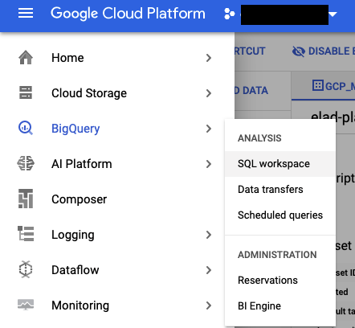
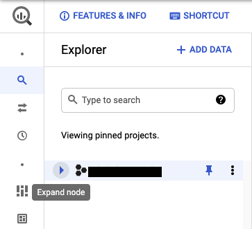
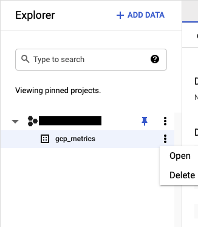

# GCP Metric Exporter

## Introduction

### About the project. 

# Time Series Data Exporter

This project is designed to export time series data points from Google Cloud Monitoring and load them into a BigQuery table.
## What it does?
This project is designed to:
- **Extract** time series data points from **Google Cloud Monitoring**, which is Google's service for monitoring, logging, and diagnostics within the Google Cloud Platform ecosystem.
- **Transform** this data into a format suitable for analysis or further processing.
- **Load** the transformed data into a **BigQuery table**. BigQuery is Google's fully managed, serverless data warehouse that enables super-fast SQL queries using the processing power of Google's infrastructure.

### Key Features:
- **Automated Data Export**: Automates the process of fetching data from Google Cloud Monitoring metrics.
- **Data Transformation**: Handles the conversion of monitoring data into a structured format that aligns with BigQuery's schema requirements.
- **Scheduled Jobs**: Supports setting up cron jobs or Cloud Scheduler for regular data updates.
- **Scalability**: Designed to handle large volumes of data, making it suitable for enterprise-level applications.

### Use Cases:
- **Performance Monitoring**: Track application performance metrics over time, such as latency, error rates, or throughput.
- **Resource Utilization**: Monitor CPU, memory, disk usage, etc., across your cloud resources to optimize costs and performance.
- **Compliance and Reporting**: Aggregate data for compliance checks or to generate reports for business intelligence.

### How It Works:
1. **Authentication**: The tool uses Google Cloud's authentication mechanisms to access Google Cloud Monitoring data securely.
2. **Data Fetching**: It queries Google Cloud Monitoring for specific metrics based on user-defined parameters (like time range, resource type, etc.).
3. **Data Processing**: The raw data is transformed into a suitable format. This might involve filtering, aggregation, or formatting to match BigQuery's schema.
4. **Data Loading**: The processed data is then uploaded to a pre-specified BigQuery table, where it can be easily queried or analyzed.

### Importance

The GCP Metric Exporter project created to address the following points:

* Data retention - Following the GCP Monitoring service [retention policy](https://cloud.google.com/monitoring/quotas#data_retention_policy), metrics data will be stored for a limited time, most of the GCP services metrics will retain for 6 weeks, and then will be deleted. 
* Data analysis - Storing metric data in a BigQuery provide a better way to perform a complex analysis of GCP services over time using Standard SQL.

### Architecture

1) Cloud Scheduler - For each metric export I will create new cloud scheduler that contains the required information of the export job the message body and to manage the HTTP trigger.

2) Cloud Function - This function is responsible for executing the export step using the information provided by the cloud scheduler and triggered by HTTP endpoint, and loading the data into the BigQuery.

3) Cloud Storage - The cloud function will make the API call and split the response into different files (using the parameter PAGE_SIZE), and will store it on GCS for the load job into BQ.

4) BigQuery - Store the exported metrics data for future analysis (One table for each metric).


## Prerequisite

In order to run this project there's a need to have:

* [Google Cloud SDK](https://cloud.google.com/sdk/docs/install)
* [gsutil](https://cloud.google.com/storage/docs/gsutil_install)
* ```Python >= 3.6```

Please run the following command to install local Python dependencies:

```pip install -r ./local-requirements.txt ```

## Installation

### Authentication
Authenticate with your user using the gcloud SDK by running the following command:

```gcloud auth login```

For more information visit [gcloud auth login documentation](https://cloud.google.com/sdk/gcloud/reference/auth/login).

### Configure the Makefile parameters

In order to deploy the pipeline there are configuration parameters on the Makefile that needs to be configured:

- ```PROJECT_ID``` - GCP project id.

- ```CF_REGION``` - GCP region for deploying the Cloud Function.

- ```TIMEOUT``` - Cloud Function timeout (MAX=540).

- ```MEMORY``` - Cloud Function memory in MB (MAX=8192MB).

- ```EXPORT_NAME``` - Keep this name unique for each metric export, this is the scheduler name as well as the table name in BigQuery.

- ```TIME_ZONE``` - Time zone of the Cloud Scheduler.

- ```SCHEDULE``` - [Cron expression](https://cloud.google.com/scheduler/docs/configuring/cron-job-schedules) for triggering the export (Cloud Scheduler).

- ```WEEKS``` - The number of weeks back to get the metric data for each runtime.

- ```DAYS``` - The number of days back to get the metric data for each runtime.

- ```HOURS``` - The number of hours back to get the metric data for each runtime.

- ```FILTER``` - The cloud monitoring [filter expression](https://cloud.google.com/monitoring/api/v3/filters), keep the pattern of single quote (') on the outer part of the filter and double quote (") inside the filter. Example: ```FILTER='metric.type = "storage.googleapis.com/storage/object_count"'```

- ```BQ_DATASET``` - BigQuery dataset name, Configure only at the first deployment.

- ```BQ_LOCATION``` - BigQuery dataset location, Configure only at the first deployment.

- ```PAGE_SIZE``` - The pagination size for splitting the API response by the number of data points.


### Create BigQuery Dataset:

In order to create the BigQuery dataset run the following command:

```
make create_bq_dataset
```

### Exporting environment variable

Please run the following to export required variables:

```
export PROJECT_ID=<YOUR-PORJECT-ID>
export BUCKET_NAME="${PROJECT_ID}-metric-exporter"
```
### Create GCS Bucket

```
gsutil mb gs://${BUCKET_NAME}
```

### Cloud Function service account

The cloud function will preform an API call to GCP Monitoring service and load data into a BigQuery table, for that, we will create a custom role to follow [Least privilege](https://cloud.google.com/iam/docs/using-iam-securely#least_privilege) GCP IAM recommendation.

Please run the following command to create custom role with the monitoring.timeSeries.list permission:
```
gcloud iam roles create metric_exporter_cf_monitoring_api_role --project=${PROJECT_ID} \
  --title=metric_exporter_cf_monitoring_api_role --description="Role for Monitoring API timeSeries.list" \
  --permissions=monitoring.timeSeries.list --stage=GA
```

Create the Cloud Function service account:

```
gcloud iam service-accounts create metric-exporter-cf-sa \
    --description="Cloud Function metric exporter service account" \
    --display-name="Cloud Functio metric exporter service account"
```
### Grant permissions

Monitoring API:
```
gcloud projects add-iam-policy-binding ${PROJECT_ID} \
    --member="serviceAccount:metric-exporter-cf-sa@${PROJECT_ID}.iam.gserviceaccount.com" \
    --role="projects/${PROJECT_ID}/roles/metric_exporter_cf_monitoring_api_role"
```

BigQuery:

```
gcloud projects add-iam-policy-binding ${PROJECT_ID} \
    --member="serviceAccount:metric-exporter-cf-sa@${PROJECT_ID}.iam.gserviceaccount.com" \
    --role="roles/bigquery.user"
```

GCS:

```
gsutil iam ch serviceAccount:metric-exporter-cf-sa@${PROJECT_ID}.iam.gserviceaccount.com:legacyBucketWriter gs://${BUCKET_NAME}
```


The last permission for the Cloud Function service account is the Data Editor on the Dataset level, please follow the bellow steps (irrelevant information blacked):

Please copy the cloud function service account name, you can get it by running the following command:

```make get_cf_sa_name```

On the GCP console please navigate to Bigquery:



On the BigQuery UI, under your BigQuery project, click on expend node:



On this page you can see your datasets that you created on previews step under your project. Click on the tree dots to the right of the dataset name, and them click on "Open":



On the next page, please click on "SHARE DATASET":


On the new page, please enter the service account name (in blue), and for the role, please click on "Select a role" and chose BigQuery > BigQuery Data Editor: 


Now please click on "ADD" and on "Done".

For more information visit [granting access to a dataset](https://cloud.google.com/bigquery/docs/dataset-access-controls#granting_access_to_a_dataset).

### Cloud Scheduler Service account 
Create the Cloud Scheduler service account:

```
gcloud iam service-accounts create metric-exporter-scheduler-sa \
    --description="Cloud Scheduler metric exporter service account" \
    --display-name="Cloud Scheduler metric exporter service account"
```

Grant to the scheduler service account the "Cloud function invoker" role:

```
gcloud projects add-iam-policy-binding ${PROJECT_ID} \
    --member="serviceAccount:metric-exporter-scheduler-sa@${PROJECT_ID}.iam.gserviceaccount.com" \
    --role="roles/cloudfunctions.invoker"
```

## Deploy
<b> Make sure that all the parameter in the makefile are correct before running the following.</b>

Now we are all set for deploy.

In order to deploy the Cloud Function and Schedule the first export please run the command:

```make full_deploy```

When you get the following question:

```Allow unauthenticated invocations of new function [metric_exporter]?```

type "N" in order to prevent any unauthenticated invocation.

In case that you already have a Cloud Function, and you want to deploy on new export, please run the following command to deploy new cloud scheduler:

```make schedule_metric_export```

## Clean

To delete the Cloud Function please run:

``` make delete_cloud_function ```

To specific export please run:

``` delete_scheduler ```

Any comments or suggestions are welcome.
